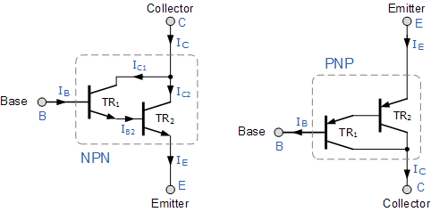

# Glowing Ring
## Problem Statement
Make a ring that glows when a person wears it.
## Mechanism for Detection

* The main objective of this project is to make it as small as possible. **A Darlington Circuit** can act as a touch sensor.
* I got this idea from **Project-24** of **Mini Task 1** where it is also used as a touch sensor.
* A Darlington circuit is simple in connections, yet it has excellent features.
* Darlington pair can be defined as two bipolar transistors connected in such a way that the current amplified by the first one is further amplified by the second transistor.
* As shown above we have used two **BC547** transistors whose collectors are tied together and the emitter of the first transistor is connected with the Base of the second transistor.
* This circuit acts as an amplifier with a gain, meaning any small signal given to the base of the first transistor is enough to bias the base of the second transistor.
* Our body acts as a ground here so whenever we touch the base of the transistor the second transistor gets biased. Using this to our favour we have built the touch sensor for this project.
## Power Supply
As it is a ring and we cannot afford to use anything that takes up a lot of space, two 1.5V button cells is appropriate for this project.
##
